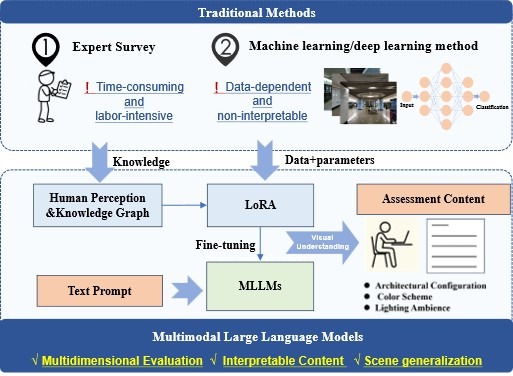
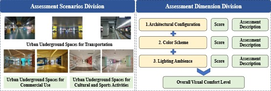
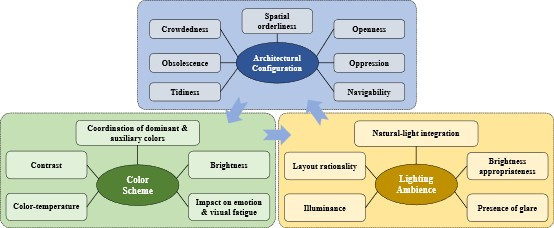

# Knowledge-Driven Human-Centric Assessment of Visual Comfort in Urban Underground Spaces: A Structured Paradigm for Multimodal Large Language Model Reasoning

This repository provides the released data splits, training configuration, and LLaMA-Factory code modifications for the paper **"Knowledge-Driven Human-Centric Assessment of Visual Comfort in Urban Underground Spaces: A Structured Paradigm for Multimodal Large Language Model Reasoning."**

Urban underground spaces are difficult to evaluate with conventional visual-comfort workflows: questionnaire studies are costly and subjective, while traditional vision classifiers usually return only discrete labels without interpretable design evidence. This project reformulates visual comfort assessment as a structured reasoning task: the model describes visual evidence, decomposes comfort across three dimensions, and predicts a 1-5 overall comfort level.



## Overview

- A multidimensional framework for visual comfort assessment in urban underground spaces.
- A structured annotation process coupling quantitative comfort scores with interpretable visual descriptions.
- A template-constrained reasoning output that generates both comfort ratings and traceable evaluation narratives.
- A composite-loss fine-tuning strategy for balancing explanation quality and comfort-level prediction.

## Framework

The assessment framework is organized around three human-centric dimensions: **architectural configuration**, **color scheme**, and **lighting ambience**.



The annotation schema links each dimension to knowledge-graph nodes and image-based evidence, turning broad perceptual judgments into structured reasoning.



## Dataset

The released JSON files contain **2,492 image-text pairs** in a LLaMA-Factory-compatible ShareGPT-style multimodal format.

| Split | Samples |
| --- | ---: |
| Train | 1,993 |
| Validation | 249 |
| Test | 250 |

Each sample contains a system prompt, a user prompt with an image placeholder, a structured assistant response, and one image file name. Image files are distributed separately and are not included in this repository; see [data/README.md](data/README.md).

The assistant response follows this structure:

```text
<THINK>
场景描述：...
建筑布局：...
<建筑布局评分：1-5>
色彩搭配：...
<色彩搭配评分：1-5>
照明设计：...
<照明设计评分：1-5>
<ANSWER>
整体舒适度等级：1-5。
```

## Method

Fine-tuning is implemented on top of LLaMA-Factory. The released SFT code introduces two special output markers:

- `<THINK>` marks the structured explanation segment.
- `<ANSWER>` marks the final overall comfort-level prediction.

The custom collator builds separate labels for the explanation and answer segments, and the trainer computes a composite objective:

```text
L = 0.4 * L_think + 0.6 * L_answer
```

`L_think` supervises the structured reasoning text. `L_answer` supervises the final numeric comfort level token (`1`-`5`), matching the paper's emphasis on logical consistency between explanations and comfort ratings.

## Repository Contents

- `data/train_data.json`: training split
- `data/val_data.json`: validation split
- `data/test_data.json`: test split
- `data/dataset_info.json`: LLaMA-Factory dataset registration
- `config/train_qwen2_5_vl_lora.yaml`: fine-tuning configuration
- `src/llamafactory/train/sft/`: modified SFT workflow, collator, and trainer
- `scripts/install_into_llamafactory.sh`: helper script for replacing the corresponding files in a LLaMA-Factory checkout
- `docs/reproducibility.md`: split statistics, score distribution, and training details
- `assets/figures/`: paper figures used for project documentation

## Installation

Clone LLaMA-Factory and install its dependencies:

```bash
git clone https://github.com/hiyouga/LLaMA-Factory.git
cd LLaMA-Factory
pip install -e ".[torch,metrics]"
```

Copy the released files into the LLaMA-Factory checkout:

```bash
bash /path/to/Assessment-of-Visual-Comfort-in-Urban-Underground-Spaces/scripts/install_into_llamafactory.sh /path/to/LLaMA-Factory
```

**Important:** the files under `src/llamafactory/train/sft/` are not standalone scripts. They are modified versions of LLaMA-Factory's original SFT modules and should replace the corresponding files in:

```text
LLaMA-Factory/src/llamafactory/train/sft/
```

The install script performs this replacement automatically.

## Image Placement

After downloading the image files from the separate image link, place them under:

```text
LLaMA-Factory/data/images/
```

The released JSON files store image file names only, such as:

```json
"images": ["2038.jpg"]
```

If your local data loader expects paths relative to `data/`, either update the JSON entries to `images/2038.jpg` or place/copy the image files directly under `LLaMA-Factory/data/`.

## Training

From the LLaMA-Factory checkout:

```bash
llamafactory-cli train config/train_qwen2_5_vl_lora.yaml
```

Main training settings:

| Item | Setting |
| --- | --- |
| Base model | `Qwen2.5-VL-7B-Instruct` |
| Fine-tuning | LoRA |
| Template | `qwen2_vl` |
| LoRA rank / alpha / dropout | `8 / 16 / 0` |
| Learning rate | `5e-5` |
| Scheduler | cosine |
| Batch size | `2` |
| Gradient accumulation | `8` |
| Epochs | `10` |
| Composite loss weights | `think=0.4`, `answer=0.6` |

## Notes

- To request the original image data, please contact zhoubiao@tongji.edu.cn.
